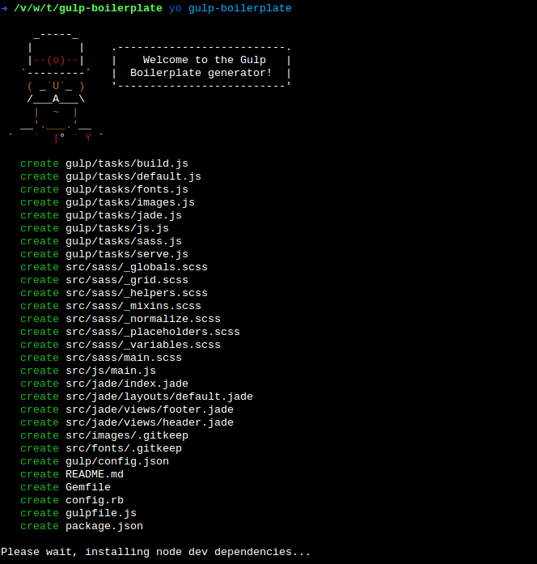

Eu criei um [repositório](https://github.com/nandomoreirame/gulp-boilerplate) no [Github](https://github.com/) onde mantenho atualizado com um **boilerplate** para Gulp, o repositório era pra ser pessoal mas eu resolvi compartilhar.

Todo mundo já usou ou já ouviu falar dos pacotes do [NodeJS](https://nodejs.org/) os famosos [npm](https://www.npmjs.com/), eu queria saber como fazer um e talvez, quem sabe, criar um pra saber que gostinho tem :)

Eu gosto muito da ideia do [Yeoman](http://yeoman.io/) de poder iniciar um projeto rápido com os seus _[generators](http://yeoman.io/generators/)_, dai eu pensei: **"Porque não fazer o um generator também?"**

Dessa ideia que saiu o [Generator Gulp Boilerplate](https://github.com/nandomoreirame/generator-gulp-boilerplate).

A documentação do Yeoman é bem simples e fazer um generator é bem fácil, eu realmente não tive dificuldades e com a ajuda do [blog do Da2k](http://blog.da2k.com.br/2015/03/20/criando-uma-ferramenta-de-cli-com-nodejs/) eu consegui publicar ele no repositório do npmjs.com.

## Como usar o Yeoman

Como o **Yeoman** é um componente do **NodeJS** então você deve instalar ele com o comando `npm install`, assim:

```bash
sudo npm install -g yo
```

Com o Yeoman devidamente instalado em sua máquina basta só ir no [repositório](http://yeoman.io/generators/) e escolher o generator que quer instalar, a escolha não vai ser fácil pois atualmente tem mais de _**3 mil**_ generators no repositório do Yeoman.

> Procure por "gulp-boilerplate" no campo de busca que vc vai encontrar o meu generator por lá..

Após escolher o seu generator basca clicar nele que você irá para o repositório do Github do generator, lá terá a documentação daquele generator, basta segui-la.

## Instalando o Gulp Boilerplate

Para instalar o **Gulp Boilerplate** basta executar o seguinte comando:

```bash
sudo npm install -g generator-gulp-boilerplate
```

Simples e fácil.

## Usando um generator

Crie um diretório para trabalhar e entre nele.

```bash
mkdir my-project
cd my-project/
```

Basta executar o generator que foi escolhido e instalado por você basta escrever `yo` e em seguida o _"slug"_ do generator, assim:

```bash
yo gulp-boilerplate
```

O generator vai criar todo o _"start"_ do projeto pra você, sem reclamar ;)



## Raio-x do Gulp Boilerplate

> "Mas afinal o que tem de especial nesse tal Gulp Boilerplate pra me fazer instalar e usar ele?"

Calma jovem, vou listar abaixo todos os pacotes e as tasks do Gulp Boilerplate pra você não ficar ai todo curioso:

#### Pacotes gulp

* [browser-sync](http://browsersync.io/)
* [gulp](https://npmjs.com/package/gulp)
* [gulp-autoprefixer](https://npmjs.com/package/gulp-autoprefixer)
* [gulp-combine-media-queries](https://npmjs.com/package/gulp-combine-media-queries)
* [gulp-compass](https://npmjs.com/package/gulp-compass)
* [gulp-imagemin](https://npmjs.com/package/gulp-imagemin)
* [gulp-include](https://npmjs.com/package/gulp-include)
* [gulp-jade](https://npmjs.com/package/gulp-jade)
* [gulp-jshint](https://npmjs.com/package/gulp-jshint)
* [gulp-load-plugins](https://npmjs.com/package/gulp-load-plugins)
* [gulp-minify-css](https://npmjs.com/package/gulp-minify-css)
* [gulp-plumber](https://npmjs.com/package/gulp-plumber)
* [gulp-rename](https://npmjs.com/package/gulp-rename)
* [gulp-size](https://npmjs.com/package/gulp-size)
* [gulp-uglify](https://npmjs.com/package/gulp-uglify)
* [imagemin-pngquant](https://npmjs.com/package/imagemin-pngquant)
* [jade](https://npmjs.com/package/jade)
* [require-dir](https://npmjs.com/package/require-dir)
* [run-sequence](https://npmjs.com/package/run-sequence)

#### Tasks

* `gulp default` ou apenas `gulp`: executa a task `gulp serve`
* `gulp serve`: executa o **watch** do projeto para os arquivos de `.jade`, `.sass` e `.js` e executa também um servidor usando o `browser-sync` e toda a vez que um arquivo HTML, CSS ou JS é alterado ele dá o _reload_ nos navegadores.
* `gulp html`: usando os pacotes [jade](https://www.npmjs.com/package/jade) e [gulp-jade](https://www.npmjs.com/package/gulp-jade) essa tarefa processa arquivos [.jade](http://jade-lang.com/)
* `gulp sass`: tarefa para executar o pré-processador [SASS](http://sass-lang.com/), aqui usamos o pacote [gulp-compass](https://www.npmjs.com/package/gulp-compass).
* `gulp lint`: aqui executamos o `lint` para aquivos que estão em `js/components/` que são os arquinos js de produção.
* `gulp js`: essa tarefa usa o pacote [gulp-include](https://www.npmjs.com/package/gulp-include) para incluir arquivos JS como é feito em **SASS** e emseguida minificar e salvar em dois aquivos `FILE.js` e `FILE.min.js`.
* `gulp images`: usando [gulp-imagemin](https://www.npmjs.com/package/gulp-imagemin) e [imagemin-pngquant](https://www.npmjs.com/package/imagemin-pngquant) reduzimos o tamanho de todas as imagens para produção.
* `gulp fonts`: apenas copiamos do diretório `/src/fonts/` para `dist/assets/fonts/`
* `gulp build`: faz o **build** do projeto executando as tasks `gulp html`, `gulp sass`, `gulp js`, `gulp images` e `gulp fonts`

Bem, basicamente essa é a forma que eu trabalho com gulp, se você gostou da um like e um fork lá do repositório do projeto e comenta ai em baixo.

Abraço.

/end
