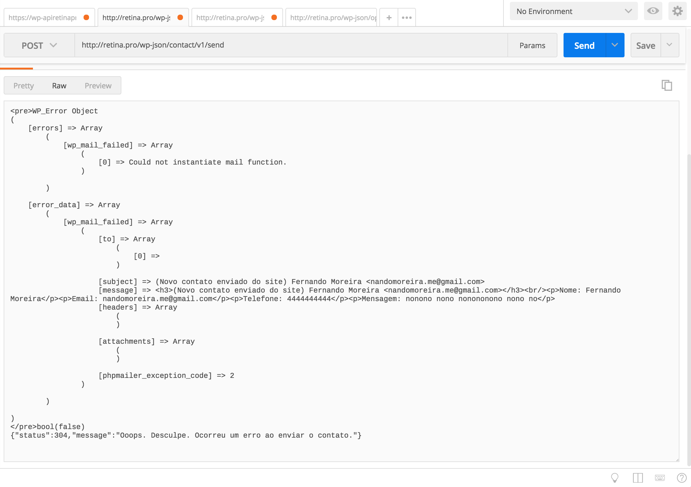

Sabemos que da pra fazer bastante coisa no WordPress usando os famosos hooks e sabemos também que é impossível saber o retorno de um erro ao tentar enviar um email usando a função wp_mail(), pois ela só retorna valores booleanos (true ou false).

Sabendo disso o **WordPress** já nos deu uma [saída dessa cilada bino!](../../images/its-a-trap-bino.jpg)

[Usando o hook `wp_mail_failed`](https://developer.wordpress.org/reference/hooks/wp_mail_failed/) podemos criar uma função para captar os erros gerados pela `wp_mail()`.

<div class="language-filename">functions.php</div>

```php
<?php
add_action( 'wp_mail_failed', 'onMailError', 10, 1 );
function onMailError( $wp_error ) {
    echo '<pre>' . print_r($wp_error , true ) . '</pre>';
}
```

E usando o [Postman](https://www.getpostman.com/) eu simulei uma requisição para minha aplicação e BAZINGA!



É isso ai pessoal, se curtiu comenta ai.

`exit();`
