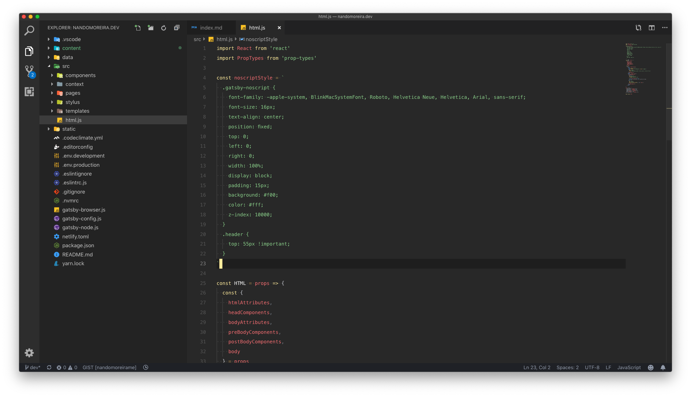

## Introdução

O [Gatsby](https://www.gatsbyjs.org/) é uma ótima ferramenta para desenvolver lindos projetos utilizando [React](https://reactjs.org/) e unindo o recurso de **<abbr title="Server Side Rendering">SSR</abbr>** e **<abbr title="Single Page Application">SPA</abbr>**, sem contar que ele é um gerador de artivos estáticos, que facilita muito **SEO** e **acessibilidade** do seu site.

O Gatsby, assim como é uma boa prática em todos os projetos <abbr title="Single Page Application">SPA</abbr>, usa o recurso da tag `<noscript>` para exibir uma mensagem para o usuário informando que o site funciona melhor com o [JavaScript](https://link) habilitado no navegador.

E nesse artigo vou explicar commo customizar essa mensagem usando o [Customizing html.js](https://www.gatsbyjs.org/docs/custom-html/) recurso do próprio **Gatsby** para alterar o HTML base da aplicação.



## Copiando o HTML do .cache

O Gatsby gera um diretório chamado `.cache` na raiz do seu projeto, **você deve ter iniciado o Gatsby pelo menos uma vez em sua máquina**.

Dentro dessa pasta tem um arquivo chamado `default-html.js`, basta copiar ele para `src/html.js`.

```sh
cp .cache/default-html.js src/html.js
```

Leia a documentação do Gatsby para mais detalhes.

## Alterando a mensagem e adicionando uma class

Abra o aquivo `html.js` em seu editor favorito, você verá algo como isso:

<div class="language-filename">src/html.js</div>

```javascript
import React from "react"
import PropTypes from "prop-types"

export default function HTML(props) {
  return (
    <html {...props.htmlAttributes}>
      <head>
        <meta charSet="utf-8" />
        <meta httpEquiv="x-ua-compatible" content="ie=edge" />
        <meta
          name="viewport"
          content="width=device-width, initial-scale=1, shrink-to-fit=no"
        />
        {props.headComponents}
      </head>
      <body {...props.bodyAttributes}>
        {props.preBodyComponents}
        <noscript key="noscript" id="gatsby-noscript">
          This app works best with JavaScript enabled.
        </noscript>
        <div
          key={`body`}
          id="___gatsby"
          dangerouslySetInnerHTML={{ __html: props.body }}
        />
        {props.postBodyComponents}
      </body>
    </html>
  )
}

HTML.propTypes = {
  htmlAttributes: PropTypes.object,
  headComponents: PropTypes.array,
  bodyAttributes: PropTypes.object,
  preBodyComponents: PropTypes.array,
  body: PropTypes.string,
  postBodyComponents: PropTypes.array,
}
```

Se o seu arquivo está igual a esse código acima então encontre a tag `<noscript>` e adicione a classe `gatsby-noscript`, **lembrando que é um arquivo JavaScript React, então não é `class`, mas `className`**.

```html
<noscript key="noscript" id="gatsby-noscript" className="gatsby-noscript">
  This app works best with JavaScript enabled.
</noscript>
```

### Adicionando o CSS

Para adicionar o CSS vamos criar uma variável chamada `noscriptStyle` entre os imports e o início da função, e iremos atribuir a ela nossos estilos.

Seria algo como isso:

```javascript
const noscriptStyle = `
  .gatsby-noscript {
    /* adicionamos os CSS para a mensagem aqui... */
    font-family: -apple-system, BlinkMacSystemFont, Roboto, Helvetica Neue, Helvetica, Arial, sans-serif;
    font-size: 16px;
    text-align: center;
    position: fixed;
    top: 0;
    left: 0;
    right: 0;
    width: 100%;
    display: block;
    padding: 15px;
    background: #f00;
    color: #fff;
    z-index: 10000;
  }
`;
```

Feito isso vamos inserir essa variável dentro da tag `<noscript>`, junto com a mensagem.

```javascript
<noscript key="noscript" id="gatsby-noscript" className="gatsby-noscript">
  <style>{noscriptStyle}</style>
  This app works best with JavaScript enabled.
</noscript>
```

## Demonstração

Para ver como ficou basta desativar o javascript do seu navegador aqui mesmo nessa página que a mensagem vai aparecer.


## Bônus

Você pode editar qualquer coisa nesse template JavaScript, só atenção para as variáveis props `htmlAttributes`, `headComponents`, `bodyAttributes`, `preBodyComponents`, `postBodyComponents` e `body`, essas props fazem o Gatsby funcionar corretamente.

Eu mesmo dei uma modificada para deixar dentro do padrão (eslint) do meu projeto, pode ver o código-fonte do meu html customizado [aqui no repositório do meu site](https://github.com/nandomoreirame/nandomoreira.dev/blob/dev/src/html.js#L4).

Quanto ao CSS, use e abuse, você pode mudar bastante coisa no seu site com ele, como eu tenho o header fixo no topo tive que [mover ele `55px` do topo para posicionar a mensagem](https://github.com/nandomoreirame/nandomoreira.dev/blob/dev/src/html.js#L20-L22).

É isso ai, divirta-se!

`{goodbye}`